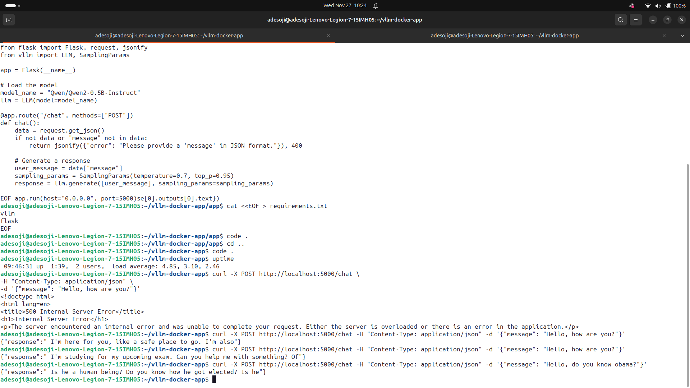

# VLLM-Docker

How vLLM and Docker are Changing the Game for LLM Deployments

## Note

float16 is only supported on GPUs with compute capability of at least 8.0. Your NVIDIA GeForce RTX 2060 GPU has compute capability 7.5. You can use float16 instead by explicitly setting the`dtype` flag in CLI, for example: --dtype=half.

You can use float16 instead by explicitly setting the`dtype` flag in CLI, for example: --dtype=half.

```bash

llm = LLM(model=model_name, dtype="half")
```

### Start the application

Create a virtual environment in the root of this  project, you can see the requirements.txt file [here](app/requirements.txt)

In addition, install the requirements.txt 

```
pip install -r requirements.xtx
```

Now proceed to start the application with the comand below depending on whether you use python or python3

```
python main.py
```

The server runs below like the content in the image below


Now Interact with the LLM By making a curl request as seen in the image below



```

curl -X POST http://localhost:5000/chat \
-H "Content-Type: application/json" \
-d '{"message": "Hello, how are you?"}'
```


### Accessing the Model Response

Once your app is running using `python app/main.py`, the Flask application will start a local server on `http://0.0.0.0:5000`. You can interact with it by sending a POST request to the `/chat` endpoint.

#### Example Request:

You can use `curl` to test it:

```bash
curl -X POST http://localhost:5000/chat \
-H "Content-Type: application/json" \
-d '{"message": "Hello, how are you?"}'
```

#### Expected Response:

If everything is set up correctly, the model will process the input message and return a response like this:

```json
{
  "response": "I am just a model, but I'm doing well. How can I assist you today?"
}
``` 🚀